# TG_fastAPI

Телеграм бот для просмотра постов с админкой на FastAPI

---

# Технологии⚙️
* python 3.11
* FastAPI
* Tortoise ORM + Aerich (миграции)
* PostgreSQL
* Docker + Docker Compose
* PythonTelegramBot
* JWT (аутентификация)
---
# Установка и запуск🚀
1) Клонировать репозиторий любым удобным способом
2) Установить docker и docker-compose
3) Собрать контейнер командой:
    ```commandline
    docker-compose up --build
    ```
4) Дождаться миграций (они запускаются автоматически через aerich)
5) FastAPI будет доступен по адресу http://localhost:8000
6) Телеграм-бот запускается параллельно и подключается к API
    доступен тут: https://t.me/TgFastApiTestBot
---
# Структура проекта🌳

## API
Проект адмники на FastAPI

- [app](app)
- - [auth](app/auth) - эндпоинты регистрации и авторизации
- - [posts](app/posts) - эндпоинты постов и их логика
- - [schemas](app/schemas) - pydentic schemas для постов и эндпоинтов авторизации
- - [security](app/security) - логика работы с JWT
- - [main](app/main.py) - точка входа проекта
- - [logger_config](app/logger_config.py) - конфиг для логера
---

## Bot
Проект телеграм-бота

- [bot](bot)
- - [api_client](bot/api_client.py) - функции для взаимодействия с API
- - [keyboards](bot/keyboards.py) - создание клавиатур
- - [posts](bot/posts.py) - обработка команд и callback связанных с постами
- - [utils](bot/utils.py) - вспомогательные утилиты
- - [main](bot/main.py) - точка входа бота
- - [logger_config](bot/logger_config.py) - конфиг для логера

---
## База данных
Работа с PostgreSQL, миграции

- [db](db) - Модели БД
- [configs](configs) - конфигурация подключения Tortoise ORM + Aerich к PostgreSQL
- [migrations](migrations) - мигарции
---

## Инфраструктура
Настройка и развертка контейнера и `images`, настройки `Aerich`, зависимости `python`
- [docker-compose](docker-compose.yml)
- [Dockerfile](Dockerfile)
- [poetry.lock](poetry.lock)
- [pyproject.toml](pyproject.toml)
- [requirements.txt](requirements.txt)
- [.env](.env)
-
---
# API
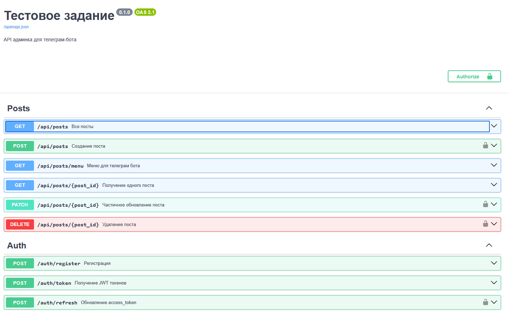
После запуска проекта вся документация доступна тут -> http://localhost:8000/docs/
## Auth
### `POST` /auth/register
Для создания новго пользователя на основе `email` и `password`
Пример запроса для bash:
```commandline
curl -d '{"email":"test@email.com", "text":"strong_password99"}' -H "Content-Type: application/json" -X POST http://localhost:8000/auth/register/
```
Пример ответа:
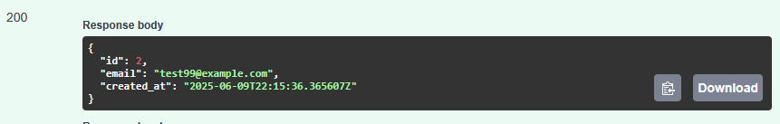
---
### `POST` /auth/token
Для получения `access_token` и `refresh_token` пользователем.
Пример запроса для bash:
```commandline
curl -X POST http://localhost:8000/auth/token
```
Пример ответа:
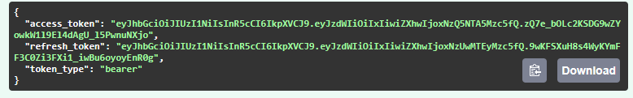

---
### `POST` /auth/refresh
Для обновления `access_token` пользователем.
Пример запроса для bash:
```commandline
curl -X POST http://localhost:8000/auth/refresh
```
Пример ответа:
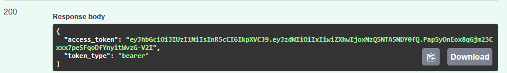
---

## Posts
### `GET` /api/posts
Для получения всех постов с подробной информацией.

Пример запроса для bash:
```commandline
curl http://localhost:8000/api/posts
```
Пример ответа:
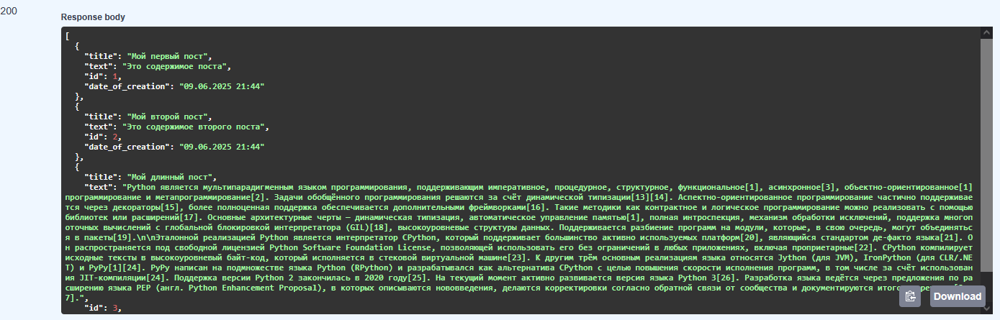

---
### `GET` /api/posts/menu
Для получения списка на основе которого строить клавиатура телеграм-бота.
Отличается от обычного запроса отсутствием `text` так как это поле не нужно для формирования клавиатуры.
Пример запроса для bash:
```commandline
curl http://localhost:8000/api/posts/menu
```
Пример ответа:
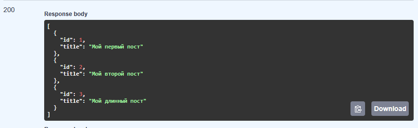

---
### `GET` /api/posts/{post_id}
Для получения данных одного поста по его `id`

Пример запроса для bash:
```commandline
curl http://localhost:8000/api/posts/1
```
Пример ответа:
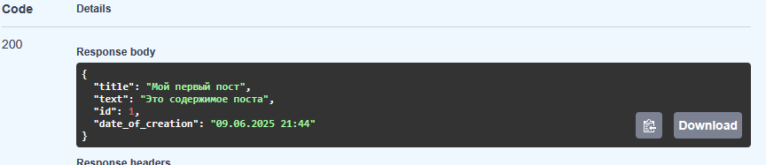

---
### `POST` /api/posts/
Создание нового поста на оснвое `title` - заголовка, `text` - текста
Для создания новго поста необходима аутентификация.


Пример запроса для bash:
```commandline
curl -d '{"title":"Мой длинный пост", "text":"Длинный текст"}' -H "Content-Type: application/json" -X POST http://localhost:8000/api/posts/
```
Пример ответа:
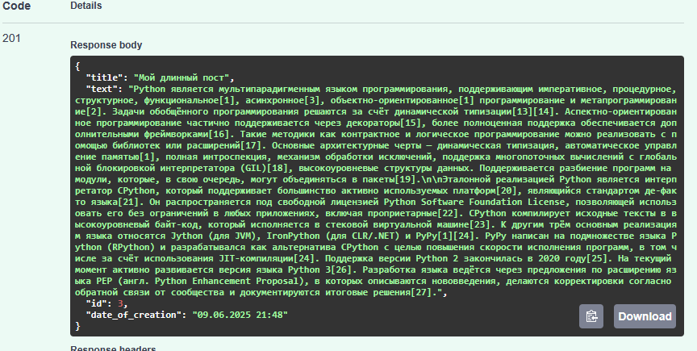
---
### `PATCH` /api/posts/{post_id}
Частичное обновление существующего поста по его `id`.
Для обновления поста необходима аутентификация.

Пример запроса для bash:
```commandline
curl -d '{"text":"Мы изменили текст"}' -H "Content-Type: application/json" -X PATCH http://localhost:8000/api/posts/1
```
Пример ответа:


---
### `DELETE` /api/posts/{post_id}
Удаление существующего поста по его `id`.
Для удаления поста необходима аутентификация.

Пример запроса для bash:
```commandline
curl -X DELETE http://localhost:8000/api/posts/4
```
Пример ответа:
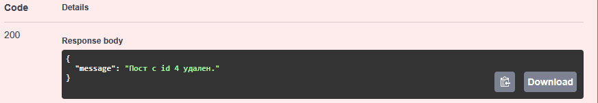

# Telegram Bot

После запуска бот доступен тут -> https://t.me/TgFastApiTestBot

## Начало работы
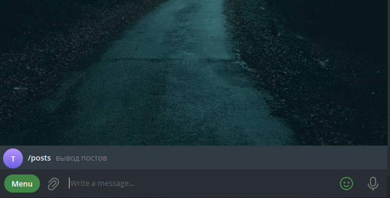

Для вывода клавиатуры постов необходимо ввести команду `/posts`
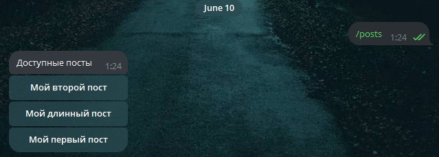

Если после получения списка постов, выбраный пост будет удален, бот сообщит об этом и обновит клавиатуру
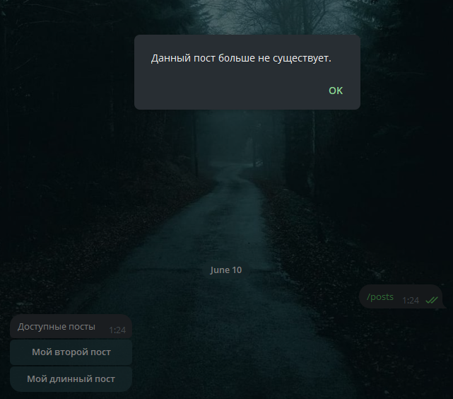

Если во время работы бот не сможет получить ответ от API, то он сообщит об этом
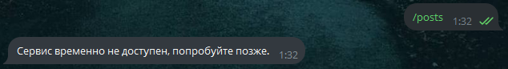

Если постов нет, бот сообщит об этом
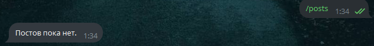

## Вывод текста поста и даты создания
Для получения текста поста и даты его создания необходимо нажать на соответствующий заголовко

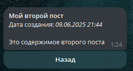

Если во время работы бот не сможет получить ответ от API, то он сообщит об этом

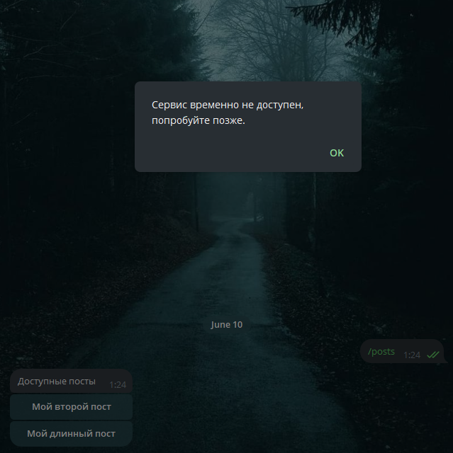

Кнопкой назад можно вернуться в главное меню.

---
